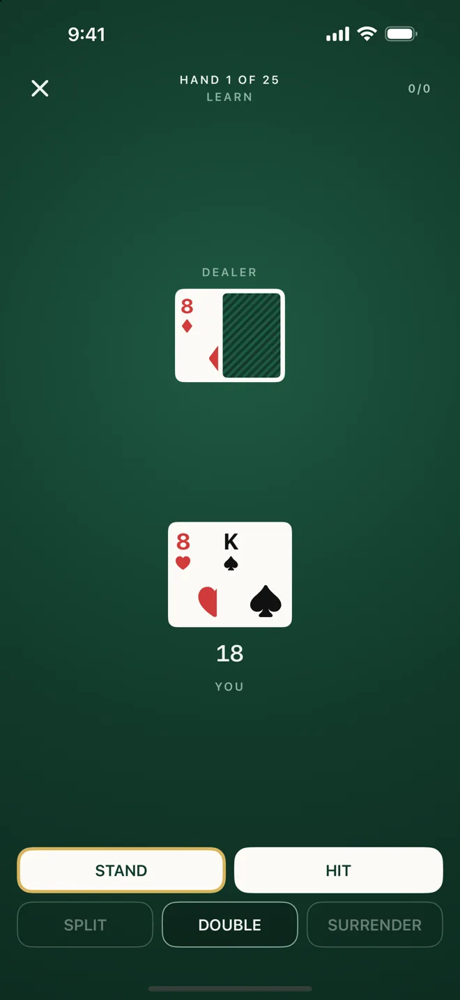

# BJS — Blackjack Training

A native iOS blackjack training app for players who want to get seriously better at the game. Not a casino app, not a gambling app — an educational tool that covers four skill areas:

1. **Basic Strategy** — drill the correct play for every hand against every upcard, with rule-specific feedback (H17 vs S17, DAS, surrender, etc.)
2. **Hi-Lo Card Counting** — count drills from true counts to betting decisions
3. **Casino Rule / House-Edge Analysis** — see how each rule variation shifts the house edge
4. **Full Card-Counting Simulation** — realistic shoe sim to pressure-test strategy under actual conditions



## Why it exists

Every other blackjack trainer I tried either (a) taught generic strategy that was wrong for the table you were actually sitting at, or (b) hid the math behind cartoons. BJS is rule-aware — you configure the exact rules of the casino you're playing and the app adjusts strategy and edge calculations to match.

The product's credibility rests on one thing: the numbers must be right.

## Status

The app layer was rebuilt on `BJSCore` in eight steps, starting 23 September 2026. Six are done and merged:

- ✅ **Engine**: rules, shoes, and a round engine with splits, surrender and peek. Strategy is decoded from Wizard of Odds' published charts and matches them cell for cell across 48 rule combinations
- ✅ **Felt design system**: tokens with tested contrast pairs, shared components, a debug catalogue
- ✅ **Strategy trainer**: learn, test, speed and weak-spot modes, graded decisions, the "Why" sheet, saved sessions
- ✅ **Counting**: card values, running-count and true-count drills
- ✅ **Edge calculator**: house edge for the configured rules, checked against 20+ reference rule combinations
- ✅ **Progress**: session history, a strategy heat map, session detail
- ⏭️ **Shoe simulation**: next
- ⏭️ **Launch prep**: accessibility pass, App Store metadata, TestFlight

As of Step 6: 263 engine tests, 233 app tests and 6 UI tests. Not released yet.

## Stack

- **Swift 6.2 / SwiftUI / SwiftData** — iOS 18+, strict concurrency enabled
- **Xcode 26.3** — required for the 6.2 toolchain
- **MVVM + `@Observable`** — fine-grained reactivity without Combine or TCA
- **Swift Testing** — parameterized tests for strategy correctness across rule combinations
- **Swift Package Manager** — `BJSCore` as a local package; no third-party dependencies
- **XcodeGen** — deterministic `.xcodeproj` from `project.yml`

## Architecture

```
BJSCore/                 — Pure Swift package, no UIKit/SwiftUI. Testable in isolation.
  Sources/BJSCore/
    Models/              — Card, Deck, Hand, Shoe
    Rules/               — Rule presets
    Round/               — RoundEngine: one round with splits, surrender, peek
    Strategy/            — Strategy tables decoded from Wizard of Odds charts
    Counting/            — Hi-Lo running/true count and drills
    Edge/                — House-edge math across rule permutations
    Explain/             — Why a play is correct
    Training/            — Hand generation, training cells, weak-spot weights
    Progress/            — Session stats, date ranges, heat-map bins
    Support/             — Seeded random number generator
  Tests/                 — Swift Testing, parameterized over rule sets

BJS/                     — iOS app
  App/                   — Entry point, tab root, launch configuration
  Design/                — Felt design system: tokens, components, debug catalogue
  Features/              — Hub, Strategy, Counting, Edge, Progress, Settings
  Persistence/           — SwiftData schema and session store
  Shared/                — Rules form, stores, router

BJSTests/                — App tests (view models, persistence, design tokens)
BJSUITests/              — One UI test suite per module
```

The split is deliberate: **all math lives in `BJSCore`**, so the rules engine and edge calculator can be tested without booting SwiftUI. That's the part that has to be right.

## Build + run

```bash
brew install xcodegen    # if you don't have it
xcodegen generate        # produces BJS.xcodeproj from project.yml
open BJS.xcodeproj
# Build + run on iPhone 16 simulator (iOS 18+)
```

Tests:

```bash
# BJSCore tests (Swift Testing)
swift test --package-path BJSCore

# App + UI tests (XCTest + Swift Testing)
xcodebuild test -scheme BJS -destination 'platform=iOS Simulator,name=iPhone 16'
```

## Design principles

- **Offline-first.** No network dependency for any training mode.
- **Math is the product.** Strategy tables and edge calculations are compile-time constants where possible, unit-tested exhaustively.
- **Rule-specific, always.** The app never displays "generic" strategy — strategy is always resolved against the current rule configuration.
- **No real-money gambling content.** App Store compliant; this is education.

---

iOS only. Desktop not planned.
